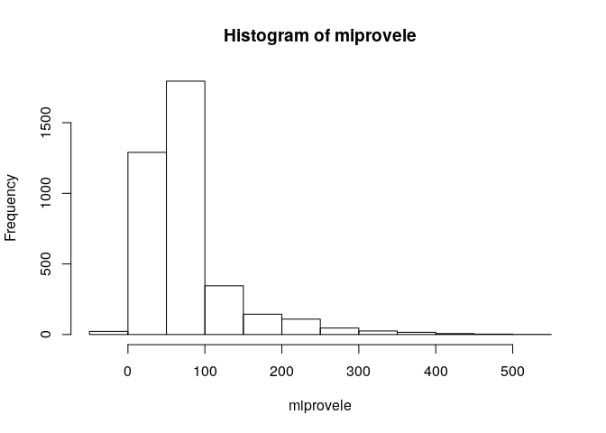

Unidad 1, asignación 2: exportar datos, leer ráster y extraer valores
=====================================================================

Sigo ayudando con `...`. Donde quiera que los veas, deberás sustituirlos por lo que indique el correspondiente mandato.

Dentro de las opciones de `knitr`, en el encabezado de este archivo, es probable que encuentres el argumento `eval = F`. Antes de tejer debes cambiarlo a `eval = T`, para que evalúe los bloques de código según tus cambios.

Provincia asignada
------------------

Toma nota del código de tu provincia asignada aleatoriamente.

``` r
 # abreviatura provaleatoria
 #       acade            11
 #       agrie            09
 #       aleir            10
 #       arqco            16
 #       cindy            12
 #       franc            23
 #       geora            08
 #       hoyod            22
 #       ingan            07
 #       ingdi            19
 #       itac9            15
 #       ivanv            25
 #       lbine            30
 #       leona            24
 #       magda            20
 #       maryj            02
 #       masue            26
 #       mmvol            13
 #       naui2            29
 #       rober            27
 #       wilne            06
 #       yoenn            21
```

Paquetes
--------

-   Carga el paquete `sf` y el paquete `raster`.

``` r
library(sf)
## Linking to GEOS 3.7.1, GDAL 2.4.2, PROJ 5.2.0
library(raster)
## Loading required package: sp
library(sp)
```

Exporta
-------

-   Determina el nombre de la capa provincias con `st_layers` del archivo GeoPackage que se encuentra en la carpeta `data`.

-   Carga la capa de provincias con la función `st_read`, asignándola al objeto `prov`.

-   Genera el objeto `miprov` que sólo contenga tu provincia.

-   Usando la función `st_write`, exporta el objeto `miprov` como GeoPackage a la carpeta `data` con el nombre `miprovexportado.gpkg`.

-   Lee el archivo exportado con la función `st_read` y asígnalo al objeto `miprovexportado`. Dado que sólo tiene una capa, no tienes que especificar el argumento `layer`.

-   Imprime en pantalla el objeto `miprovexportado` (sólo necesitas escribir el nombre del objeto).

``` r
st_layers('data/divisionRD.gpkg')
## Driver: GPKG 
## Available layers:
##      layer_name geometry_type features fields
## 1 PROVCenso2010       Polygon       32      4
## 2  MUNCenso2010       Polygon      155      5
## 3  REGCenso2010       Polygon       10      2
prov <- st_read(dsn = 'data/divisionRD.gpkg', layer = 'PROVCenso2010')
## Reading layer `PROVCenso2010' from data source `/home/acade/unidad-1-asignacion-2-rasters-y-exportar-datos-espaciales-acadetev/data/divisionRD.gpkg' using driver `GPKG'
## Simple feature collection with 32 features and 4 fields
## geometry type:  MULTIPOLYGON
## dimension:      XY
## bbox:           xmin: 182215.8 ymin: 1933532 xmax: 571365.3 ymax: 2205216
## epsg (SRID):    32619
## proj4string:    +proj=utm +zone=19 +datum=WGS84 +units=m +no_defs
miprov <- prov[prov$PROV %in% '11', ]
st_write(obj = miprov, dsn ='data/miprovexportado.gpkg', driver = 'gpkg')
## Writing layer `miprovexportado' to data source `data/miprovexportado.gpkg' using driver `gpkg'
## Writing 1 features with 4 fields and geometry type Multi Polygon.
miprovexportado <- st_read(dsn = 'data/miprovexportado.gpkg')
## Reading layer `miprovexportado' from data source `/home/acade/unidad-1-asignacion-2-rasters-y-exportar-datos-espaciales-acadetev/data/miprovexportado.gpkg' using driver `GPKG'
## Simple feature collection with 1 feature and 4 fields
## geometry type:  MULTIPOLYGON
## dimension:      XY
## bbox:           xmin: 506571.8 ymin: 2012611 xmax: 571365.3 ymax: 2097944
## epsg (SRID):    32619
## proj4string:    +proj=utm +zone=19 +datum=WGS84 +units=m +no_defs
miprovexportado
## Simple feature collection with 1 feature and 4 fields
## geometry type:  MULTIPOLYGON
## dimension:      XY
## bbox:           xmin: 506571.8 ymin: 2012611 xmax: 571365.3 ymax: 2097944
## epsg (SRID):    32619
## proj4string:    +proj=utm +zone=19 +datum=WGS84 +units=m +no_defs
##   PROV REG     TOPONIMIA ENLACE                           geom
## 1   11  08 LA ALTAGRACIA   0811 MULTIPOLYGON (((516555.9 20...
```

Ráster
------

-   Con la función `raster`, carga el modelo digital de elevaciones que se encuentra en la carpeta `data`. Es el único archivo de extensión `.tif` Asígnalo al objeto `mde`

-   Genera un mapa con la función `plot`, usando la paleta de colores `terrain.colors`.

``` r
mde <- raster('data/mde_rd.tif')
plot(mde, col = terrain.colors(n = 255))
```


Extraer valores del ráster
--------------------------

-   Con la función `raster::extract`, extrae los valores de elevación correspondientes a tu provincia. Utiliza `mde` como objeto ráster y `miprov` como capa zonal. Asigna los valores al objeto `miprovele`.

-   Imprime en pantalla el objeto `miprovele` (sólo necesitas escribir el nombre del objeto).

-   Obtén los estadísticos descriptivos básicos (mínimo, primer cuartil, media, mediana, tercer cuartil, máximo) de `miprovele` con la función `summary`.

-   Genera un histograma de `miprovele` usando la función `hist`.

``` r
miprovele <- raster::extract(mde, miprov)[[1]]
miprovele
##    [1]   5.45360804   6.51999998   3.89000010   4.53999996   5.14942551
##    [6]   5.73333311  17.55999947  11.71000004  19.10000038  11.89000034
##   [11]   5.51999998   5.07000017   5.69696951  21.59000015  22.11000061
##   [16]  15.64000034  18.60000038  38.88000107  38.70000076  21.54999924
##   [21]   9.81999969   8.00000000   8.11999989   6.70270252  36.13999939
##   [26]  37.04000092  34.29000092  26.30999947  25.82999992  47.50999832
##   [31]  87.37000275  42.81999969  28.92000008  17.62000084  17.11000061
##   [36]  13.06000042   5.48913050  56.11999893  65.80999756  49.83000183
##   [41]  46.77999878  43.40000153  51.40000153 107.08999634  78.11000061
##   [46]  49.06000137  32.25000000  21.96999931  23.17000008  10.55000019
##   [51]   4.65000010   6.05084753  85.12000275  82.43000031  78.15000153
##   [56]  70.01000214  78.40000153  81.20999908 124.33999634  89.77999878
##   [61]  51.50000000  29.45999908  21.78000069  22.00000000   3.66000009
##   [66]   3.76999998   5.16216230  65.19000244  67.12999725 106.84999847
##   [71] 147.44999695 127.79000092 105.52999878  96.80999756  95.08999634
##   [76] 104.75000000 130.66000366  89.80999756  42.08000183  24.34000015
##   [81]  23.79999924  19.70000076   6.73000002   3.18181825   2.57894731
##   [86] 108.87000275  84.98000336  95.69999695 127.45999908 122.95999908
##   [91] 108.80999756 113.38999939 101.69000244  92.13999939  93.98000336
##   [96] 127.27999878 119.91000366  67.51999664  35.68999863  25.12000084
##  [101]  28.37000084  16.65999985   7.26000023   4.82999992   4.73913050
##  [106] 249.36999512 143.86000061 146.00000000 126.47000122 116.11000061
##  [111]  92.52999878  95.61000061  93.72000122  90.34999847  87.09999847
##  [116]  93.34999847 107.37999725 100.00000000  52.04000092  34.38999939
##  [121]  28.42000008  27.38999939   4.80999994   3.95000005   1.77999997
##  [126]   0.65714288 222.42999268 143.89999390 121.98000336 113.23999786
##  [131] 107.13999939 112.12000275  83.08000183  89.19999695  81.66999817
##  [136]  84.87999725  88.93000031 106.26999664  75.70999908  47.47000122
##  [141]  30.29999924  28.87999916  20.37999916   0.16000000  -0.28000000
##  [146]   0.01000000   1.25000000 290.94000244 151.83000183 149.14999390
##  [151] 165.14999390 164.77000427 132.19999695  86.30000305  83.37000275
##  [156]  86.80999756  77.66000366  83.50000000  81.26999664 110.00000000
##  [161]  71.45999908  44.72999954  31.82999992  30.95000076  12.01000023
##  [166]   1.83000004   0.67000002   0.18000001   2.21052623 232.83000183
##  [171] 174.63999939 149.02999878 134.69999695 117.34999847  99.26000214
##  [176]  75.00000000  93.50000000  75.44999695  73.90000153  72.98000336
##  [181]  86.16999817 103.98999786  72.55999756  45.81999969  32.33000183
##  [186]  30.86000061   9.77999973   3.50000000   1.00999999   2.43000007
##  [191] 336.54998779 171.00999451 205.02999878 126.37000275  89.98000336
##  [196]  78.95999908  66.15000153  65.19000244  62.97000122  71.08999634
##  [201]  66.84999847  66.91000366  83.13999939 100.52999878  60.58000183
##  [206]  39.61999893  24.30999947  28.21999931   5.36000013   0.92000002
##  [211]   2.25000000   3.59595966 421.61999512 247.55999756 257.67999268
##  [216] 209.25000000 101.94000244  97.08000183  78.69999695  74.06999969
##  [221]  73.44999695  64.86000061  56.75999832  58.29999924  71.75000000
##  [226]  90.59999847  81.45999908  60.36999893  35.65999985  31.44000053
##  [231]  20.97999954   2.25999999   2.14000010   3.16000009   5.02083349
##  [236] 508.32998657 364.14999390 287.85000610 268.01000977 209.33999634
##  [241] 113.59999847  84.65000153  84.16000366 124.80999756  93.22000122
##  [246]  88.05000305  62.27000046  60.54000092  98.98000336 103.98000336
##  [251]  77.30000305  53.65000153  39.00999832  39.90999985   8.72999954
##  [256]   2.05999994   2.61999989   4.19000006   6.87692308 460.32998657
##  [261] 264.82000732 326.77999878 231.92999268 131.17999268  83.33999634
##  [266]  89.51999664 160.55000305 177.17999268  88.91999817  61.18000031
##  [271]  50.61999893  71.88999939  82.30000305  88.61000061  75.09999847
##  [276]  58.59999847  43.41999817  27.53000069   2.26999998   2.02999997
##  [281]   1.59000003   3.97000003   3.52564096 265.41000366 284.79998779
##  [286] 299.52999878 146.91000366  90.61000061  99.94999695 221.07000732
##  [291] 226.33000183  95.20999908  78.08000183  47.91999817  64.33000183
##  [296]  71.13999939  50.47000122  68.12999725  53.95999908  43.66999817
##  [301]  36.20999908   2.15000010   1.15999997   1.34000003   1.48000002
##  [306]   1.80999994   3.72222233 303.19000244 219.67999268 218.94000244
##  [311] 267.76998901 174.22000122  94.84999847 111.72000122 244.00000000
##  [316] 219.08999634 117.18000031 130.66999817  69.94999695  46.15000153
##  [321]  43.88999939  41.63000107  44.86000061  34.34999847  21.38999939
##  [326]  22.48999977   5.19999981   1.72000003   1.36000001   1.75000000
##  [331]   1.67999995   2.28999996   4.43478251 401.60000610 282.73001099
##  [336] 153.41999817 170.88999939 116.66999817  97.16999817 135.47999573
##  [341] 305.76000977 301.42001343 201.72999573 108.01999664  84.16999817
##  [346]  68.25000000  47.95999908  26.12000084  17.05999947  17.54000092
##  [351]  21.25000000   6.90999985   3.81999993   2.65000010   1.71000004
##  [356]   1.72000003   2.35999990   2.42000008   2.75000000   5.37373734
##  [361] 375.01998901 227.22999573 248.85000610 177.27000427 114.25000000
##  [366] 128.72000122 327.89001465 425.47000122 238.64999390 144.44999695
##  [371] 132.47000122  88.69000244  54.15000153  42.24000168  28.35000038
##  [376]  23.52000046  22.19000053   6.94000006   2.70000005   3.07999992
##  [381]   1.42999995   3.04999995   3.00000000   2.51999998   4.44999981
##  [386]   4.05000019   5.46000004 462.29000854 291.25000000 212.44000244
##  [391] 170.75999451 117.43000031 143.35000610 369.23999023 357.60000610
##  [396] 193.86999512 175.27000427 114.54000092  80.36000061  68.87000275
##  [401]  56.83000183  44.36000061  29.88999939  11.97999954   5.48000002
##  [406]   3.92000008  13.93999958   3.08999991   3.92000008   4.98000002
##  [411]   3.90000010   5.17999983   2.03999996   4.21000004   4.91666651
##  [416] 372.29000854 322.45999146 247.19000244 217.49000549 129.33999634
##  [421] 196.61000061 380.70001221 277.70001221 137.47999573 160.02000427
##  [426] 124.86000061  96.94000244  79.18000031  72.19999695  52.04000092
##  [431]  29.79999924  24.12000084  17.67000008  19.10000038  16.46999931
##  [436]   7.15999985   5.75000000   3.77999997   6.42000008   6.61000013
##  [441]   4.00000000   4.75000000   4.61999989   5.02127647 348.72000122
##  [446] 298.82000732 483.92001343 356.29998779 293.10998535 227.13999939
##  [451] 151.55000305 137.02000427 269.88000488 369.02999878 205.80000305
##  [456] 119.02999878 101.43000031  90.55000305  76.93000031  79.31999969
##  [461]  64.81999969  47.49000168  31.44000053  46.95000076  37.29000092
##  [466]  20.45999908  24.62000084  28.00000000  10.13000011   3.78999996
##  [471]   6.51000023   6.65999985   4.67000008   5.15000010   6.23000002
##  [476]   5.63999987   5.03000021 302.26000977 371.32000732 247.30000305
##  [481] 287.72000122 223.52000427 219.11999512 217.71000671 175.16000366
##  [486] 181.07000732 302.08999634 255.11999512 135.67999268 142.52000427
##  [491] 130.08999634  86.69999695  68.25000000  62.79000092  53.52000046
##  [496]  41.33000183  73.84999847  56.88999939  45.65999985  24.93000031
##  [501]  27.40999985  37.40999985  26.25000000   9.27000046   5.46000004
##  [506]  10.92000008   6.36000013   7.82999992   6.46000004   5.90000010
##  [511]   5.19999981   6.65000010   9.33333302  13.13333321 357.32000732
##  [516] 274.60998535 274.98999023 292.35998535 210.78999329 223.91000366
##  [521] 258.51000977 180.53999329 181.16000366 174.66000366 205.25999451
##  [526] 282.36999512 188.61999512 155.35000610 225.42999268 160.66999817
##  [531] 124.05000305 101.48999786  74.47000122  58.02999878  61.45000076
##  [536]  90.98000336  83.83000183  44.52000046  35.79000092  31.28000069
##  [541]  37.54000092  36.63999939  19.75000000  11.43999958  11.61999989
##  [546]  17.50000000  13.14999962   6.88999987   4.44000006   5.92999983
##  [551]   7.69999981   6.34999990   7.03999996   6.52525234 316.10000610
##  [556] 269.89001465 235.86000061 202.72000122 182.80000305 220.36000061
##  [561] 333.20999146 208.46000671 163.80999756 212.22999573 228.27999878
##  [566] 351.19000244 251.85000610 271.64999390 212.61999512 172.69999695
##  [571] 192.47000122 145.69000244  98.19999695  80.87999725  86.30999756
##  [576]  97.01000214 115.69999695  68.52999878  46.70999908  47.16999817
##  [581]  53.81000137  45.99000168  33.86000061  17.64999962  12.35999966
##  [586]  16.59000015  14.40999985   8.85999966   6.78999996   9.28999996
##  [591]   8.81000042   7.07999992   6.36999989   7.98000002   5.08080816
##  [596] 257.54000854 228.69000244 225.46000671 173.38000488 239.61000061
##  [601] 211.89999390 307.05999756 199.47000122 159.44000244 198.92999268
##  [606] 194.47999573 230.05000305 320.44000244 402.92999268 309.45999146
##  [611] 288.11999512 283.19000244 233.28999329 136.36000061 113.58000183
##  [616] 130.52000427 163.78999329 110.61000061  76.62999725  67.00000000
##  [621]  58.54000092  54.97000122  60.02000046  46.68999863  31.01000023
##  [626]  19.69000053  14.17000008  11.05000019  14.10000038  10.85999966
##  [631]  11.68999958  10.52999973   8.31999969   6.90000010   9.36999989
##  [636]  10.18999958   6.09090900   5.41304350 235.38999939 250.53999329
##  [641] 208.85000610 192.58000183 212.11000061 197.36000061 196.77999878
##  [646] 185.08000183 155.38000488 208.38000488 210.72000122 207.49000549
##  [651] 275.57998657 278.47000122 213.11999512 211.00000000 181.83999634
##  [656] 175.08999634 153.67999268 244.36999512 321.85998535 279.83999634
##  [661] 117.81999969  81.19000244  72.56999969  62.27000046  63.18999863
##  [666]  63.79999924  51.15000153  40.95000076  25.94000053  16.80999947
##  [671]  15.19999981  17.73999977  16.31999969  13.39999962  12.21000004
##  [676]  10.03999996   9.53999996   8.02000046  10.53999996  11.10999966
##  [681]   5.23000002   4.68115950 231.53999329 224.80999756 203.47999573
##  [686] 219.25000000 179.71000671 246.36999512 216.22000122 160.47999573
##  [691] 248.42999268 162.53999329 162.80000305 172.64999390 207.46000671
##  [696] 324.25000000 295.26000977 315.95001221 209.57000732 174.86000061
##  [701] 148.69999695 188.27999878 372.82998657 411.73999023 255.16000366
##  [706] 139.38000488 108.19000244  79.91000366  68.83000183  66.41999817
##  [711]  67.16999817  49.25999832  32.43999863  28.15999985  28.55999947
##  [716]  26.73999977  21.37000084  22.01000023  19.51000023  12.61999989
##  [721]  11.03999996  11.22999954  10.31000042   9.50000000   8.56000042
##  [726]  11.07999992   8.18999958   4.59999990   4.81355953 191.30000305
##  [731] 203.36999512 159.96000671 185.27999878 179.30999756 243.85000610
##  [736] 184.78999329 154.86000061 230.21000671 179.16000366 144.25000000
##  [741] 188.97000122 328.45999146 277.54000854 233.19999695 215.35000610
##  [746] 229.36999512 242.74000549 187.30999756 192.94999695 388.61999512
##  [751] 209.58999634 204.44000244 172.91000366 126.87000275  85.19000244
##  [756]  72.44000244  69.50000000  59.52000046  32.13000107  26.12000084
##  [761]  44.52999878  47.61999893  38.08000183  38.52999878  23.45000076
##  [766]  25.22999954  16.85000038  12.53999996  14.23999977  12.50000000
##  [771]   9.85999966   7.92000008   7.50000000  10.02999973   7.88999987
##  [776]   4.96999979   4.48387098  99.30999756 110.26999664 166.14999390
##  [781] 261.54998779 285.75000000 155.00999451 171.03999329 159.33000183
##  [786] 165.30999756 145.42999268 148.35000610 179.77999878 242.63999939
##  [791] 183.99000549 144.86999512 171.85000610 156.53999329 141.60000610
##  [796] 206.35000610 339.26000977 217.47000122 203.27000427 176.63999939
##  [801] 312.17001343 311.42999268 158.96000671 135.41999817 202.97999573
##  [806] 167.27999878 180.21000671 239.16000366 109.94000244  72.51999664
##  [811]  58.27000046  49.52999878  30.54999924  28.04000092  38.97999954
##  [816]  43.29000092  71.73000336  57.52000046  37.81999969  35.54999924
##  [821]  22.42000008  22.12000084  17.55999947  13.05000019  14.77999973
##  [826]  10.71000004  10.31000042   7.44000006   8.00000000  10.72999954
##  [831]   9.27000046   5.53999996   6.21348333 102.33999634 116.23999786
##  [836] 154.77000427 367.04000854 425.29000854 247.25999451 170.86999512
##  [841] 158.82000732 148.25999451 164.66999817 149.21000671 135.27000427
##  [846] 200.16999817 224.00999451 152.22999573 137.11000061 182.02000427
##  [851] 165.86000061 136.63999939 162.33999634 274.94000244 296.57000732
##  [856] 192.86000061 163.11000061 231.11000061 276.48999023 214.86000061
##  [861] 171.19000244 139.00000000 133.82000732 224.14999390 238.83999634
##  [866] 100.87999725  74.97000122  53.54999924  31.29000092  33.63000107
##  [871]  45.70000076  43.56999969  43.34999847  64.16999817  78.37000275
##  [876]  56.09000015  37.81000137  34.84999847  24.46999931  23.20000076
##  [881]  18.36000061  14.80000019  15.84000015  14.92000008  14.00000000
##  [886]   8.31000042   9.93999958  12.31999969   9.61999989   7.67999983
##  [891]   5.88297892  94.88999939 114.69999695 125.01000214 249.13000488
##  [896] 411.67001343 304.97000122 163.39999390 146.33000183 136.11000061
##  [901] 141.82000732 146.42999268 127.30999756 141.60000610 167.38000488
##  [906] 148.08000183 131.75000000 188.33999634 210.66999817 152.32000732
##  [911] 135.91000366 171.14999390 278.41000366 222.19000244 157.61999512
##  [916] 172.44999695 216.41000366 289.91000366 204.61999512 199.16000366
##  [921] 126.88999939 183.16000366 213.74000549  92.37999725  63.29999924
##  [926]  43.11000061  40.81999969  57.43999863  59.70000076  54.91999817
##  [931]  54.18000031  55.31999969  72.75000000  80.91000366  56.52000046
##  [936]  43.88000107  31.09000015  24.25000000  23.70000076  18.95999908
##  [941]  19.07999992  17.25000000  16.46999931  11.61999989  12.67000008
##  [946]  13.60000038  13.82999992  10.80000019   6.13999987   5.66666651
##  [951] 124.18000031 135.36000061 172.49000549 315.92001343 386.01000977
##  [956] 204.78999329 176.49000549 141.66000366 130.99000549 125.73999786
##  [961] 121.26999664 136.52000427 131.08999634 143.00000000 122.66999817
##  [966] 179.69999695 214.66999817 203.27000427 145.19999695 130.96000671
##  [971] 161.72999573 210.36999512 191.86999512 152.41999817 209.35000610
##  [976] 202.47000122 202.11000061 218.49000549 126.90000153 118.59999847
##  [981]  98.23000336  82.30999756  76.31999969  64.62999725  71.83000183
##  [986]  78.41999817  67.38999939  61.33000183  59.63000107  57.84999847
##  [991]  65.93000031  74.62000275  79.79000092  54.09000015  42.22999954
##  [996]  28.87999916  24.36000061  22.62999916  22.65999985  20.17000008
## [1001]  20.15999985  15.56000042  15.89000034  15.18000031  13.97999954
## [1006]  13.22999954   9.15999985   5.90000010   6.57647038  83.58999634
## [1011] 103.04000092 154.22000122 161.25999451 156.89999390 249.38000488
## [1016] 373.76000977 307.29000854 288.08999634 186.86999512 155.19000244
## [1021] 152.63000488 127.56999969 121.91000366 123.22000122 197.80999756
## [1026] 125.37999725 135.66000366 158.35000610 281.98999023 204.88000488
## [1031] 129.55999756 138.30999756 169.27000427 146.69000244 146.50000000
## [1036] 180.66000366 153.47000122 167.83999634 205.92999268 163.58999634
## [1041] 179.39999390 157.94000244 164.63999939 103.31999969  86.45999908
## [1046]  82.48000336  80.56999969  72.88999939  66.00000000  66.45999908
## [1051]  63.95000076  64.48999786  70.83999634  75.20999908  78.62999725
## [1056]  57.49000168  47.18999863  30.54999924  24.75000000  25.84000015
## [1061]  21.12999916  19.76000023  20.04999924  18.35000038  19.38999939
## [1066]  14.53999996  11.63000011  13.38000011  10.18999958   6.15999985
## [1071]   5.61000013  77.80999756  98.61000061 129.19000244 136.75999451
## [1076] 145.33000183 164.08999634 182.55000305 201.72999573 155.80000305
## [1081] 146.75999451 235.36000061 261.48001099 207.96000671 113.91000366
## [1086] 113.37999725 148.94000244 124.23000336 124.91999817 148.80000305
## [1091] 183.97000122 210.61000061 140.24000549 124.73999786 140.50999451
## [1096] 141.71000671 142.22000122 161.47000122 145.55999756 142.30000305
## [1101] 173.64999390 194.85000610 216.33999634 241.50000000 227.55000305
## [1106] 120.51000214  97.84999847  78.76999664  73.20999908  70.36000061
## [1111]  69.69000244  66.30999756  66.41000366  68.40000153  71.51000214
## [1116]  72.87999725  75.81999969  80.16999817  63.90999985  46.45000076
## [1121]  30.29999924  26.04999924  27.39999962  21.15999985  22.69000053
## [1126]  20.20000076  19.68000031  18.88999939  16.05999947  16.13999939
## [1131]  15.48999977  10.78999996   6.40999985   5.76190472 107.73999786
## [1136] 117.52999878 121.54000092 134.58999634 146.36999512 135.99000549
## [1141] 127.69000244 141.41000366 176.30999756 272.95999146 189.25000000
## [1146] 121.36000061 107.69000244 104.81999969 107.04000092 116.84999847
## [1151] 135.97000122 176.10000610 162.05000305 161.96000671 117.26000214
## [1156] 134.52999878 135.16000366 131.53999329 134.16000366 159.41000366
## [1161] 143.52000427 140.08000183 155.33999634 162.35000610 158.55000305
## [1166] 148.63000488 113.81999969  91.65000153  76.50000000  70.66000366
## [1171]  71.84999847  83.22000122  83.30999756  78.87999725  78.76000214
## [1176]  81.79000092  78.26999664  76.56999969  79.59999847  85.30000305
## [1181]  64.84999847  43.61999893  29.45999908  25.79000092  29.39999962
## [1186]  23.92000008  22.81999969  22.11000061  20.92000008  20.43000031
## [1191]  15.26000023  16.60000038  15.30000019  10.68000031   8.14000034
## [1196]   5.33695650  76.98999786  94.94000244 104.91999817 100.91000366
## [1201] 112.37999725 128.27999878 146.72000122 120.87999725 121.41999817
## [1206] 139.53999329 213.80000305 159.41999817 133.86999512 126.09999847
## [1211] 104.44999695 106.27999878 116.51000214 127.20999908 171.57000732
## [1216] 152.78999329 167.72000122 122.15000153 118.08000183 134.72999573
## [1221] 128.27000427 117.59999847 135.58999634 125.45999908 137.24000549
## [1226] 161.02999878 169.58999634 128.16999817 115.79000092 103.02999878
## [1231]  90.16999817  79.79000092  72.58999634  70.65000153  79.69999695
## [1236]  90.43000031  86.93000031  85.06999969  84.33999634  85.30000305
## [1241]  84.29000092  77.37000275  81.62000275  75.98999786  61.20999908
## [1246]  39.54000092  26.78000069  28.40999985  33.11999893  25.19000053
## [1251]  25.59000015  22.69000053  21.37000084  19.63999939  15.90999985
## [1256]  17.13999939  17.36000061  10.53999996   6.34000015   3.94382024
## [1261]   3.04411769  70.98000336  75.34999847  82.19000244 110.15000153
## [1266] 104.47000122 108.30999756 116.69000244 106.90000153 116.59999847
## [1271] 131.00999451 143.58999634 144.97999573 117.00000000 100.37999725
## [1276] 109.66999817 110.12000275 116.38999939 131.83999634 157.63999939
## [1281] 139.72999573 126.12000275 109.50000000 123.29000092 130.78999329
## [1286] 112.84999847 122.43000031 118.48999786 130.39999390 135.25999451
## [1291] 140.05000305 124.23999786 106.95999908  97.90000153  87.09999847
## [1296]  79.45999908  73.19000244  71.69999695  74.75000000  84.76000214
## [1301]  96.95999908  94.04000092  89.04000092  86.66999817  83.79000092
## [1306]  85.70999908  86.58000183  85.61000061  77.33999634  61.38999939
## [1311]  36.88999939  32.25999832  32.06000137  30.62999916  27.94000053
## [1316]  27.46999931  24.42000008  22.34000015  20.65999985  17.94000053
## [1321]  20.72999954  17.60000038   8.10999966   2.65000010   1.25999999
## [1326]   1.38999999   3.52525258  68.45999908  70.90000153  88.30000305
## [1331]  88.36000061  94.13999939 105.04000092  99.98999786 110.83000183
## [1336] 115.15000153 123.55999756 141.80000305 121.50000000  98.47000122
## [1341]  91.55000305 106.37999725 126.04000092 134.78999329 161.63000488
## [1346] 178.19999695 145.63999939 126.00000000 105.04000092 113.95999908
## [1351] 114.33000183 106.19000244 105.91999817 120.05999756 123.77999878
## [1356] 119.27999878 111.76000214 100.76000214  95.68000031  81.54000092
## [1361]  74.51999664  70.45999908  72.12000275  80.18000031  84.05000305
## [1366]  85.48000336  96.98000336  99.97000122  92.77999878  88.30000305
## [1371]  87.79000092  89.98000336  89.41999817  87.76000214  82.62000275
## [1376]  66.16000366  39.38999939  35.16999817  36.75000000  30.53000069
## [1381]  29.65999985  26.04999924  24.61000061  22.94000053  21.20999908
## [1386]  18.76000023  20.14999962  13.23999977   3.51999998   1.82000005
## [1391]   0.27000001   0.13000000   1.45000005   1.51851857  70.25000000
## [1396]  73.19000244  80.33000183  97.98999786 102.94999695  95.22000122
## [1401] 100.30999756 103.33999634 112.30999756 120.19000244 118.80000305
## [1406] 103.44999695  87.12999725 102.12999725 108.56999969 125.38999939
## [1411] 135.89999390 177.33999634 173.30000305 136.58000183 108.61000061
## [1416]  98.72000122 108.22000122  95.79000092 100.91000366 108.80000305
## [1421] 121.98000336 112.98000336  97.13999939  87.30999756  83.61000061
## [1426]  75.59999847  70.66000366  68.22000122  67.30000305  72.25000000
## [1431]  99.31999969  89.70999908  90.94000244 100.41999817 114.08999634
## [1436]  99.33000183  91.62000275  92.94999695  92.52999878  94.83999634
## [1441]  91.16000366  88.75000000  78.19000244  45.65000153  37.11000061
## [1446]  36.11999893  31.90999985  28.11000061  26.20000076  25.35000038
## [1451]  23.22999954  20.88999939  20.60000038  17.63999939   6.73000002
## [1456]   1.92999995  -0.20000000  -0.51999998  -0.64999998   0.02000000
## [1461]   1.22222221  56.68000031  73.30999756  77.59999847  79.44000244
## [1466]  92.98999786  88.51999664  89.41000366 106.30999756 108.94999695
## [1471] 119.45999908 116.69000244 106.41000366  85.80999756  89.41999817
## [1476] 104.54000092 117.69000244 120.80000305 133.89999390 149.11999512
## [1481] 151.39999390 121.97000122  95.55000305  93.66999817  93.08000183
## [1486]  92.62999725 101.36000061 114.55000305  99.05000305  87.58000183
## [1491]  80.83999634  75.37999725  70.41999817  67.77999878  67.16000366
## [1496]  66.45999908  79.11000061  86.31999969 109.01999664 105.38999939
## [1501] 101.86000061  99.90000153 100.33000183  95.62000275  91.91999817
## [1506]  91.48000336  93.36000061  92.94999695  88.91000366  92.87999725
## [1511]  87.05000305  45.56000137  38.99000168  34.61000061  31.28000069
## [1516]  28.18000031  26.53000069  24.53000069  22.53000069  21.96999931
## [1521]  20.30999947  12.77000046   3.50999999   1.45000005   0.43000001
## [1526]   0.41000000   2.41000009   2.23000002   1.87777781  52.11000061
## [1531]  67.29000092  63.16999817  70.87999725  85.08000183  81.80000305
## [1536]  83.86000061 107.79000092 113.87999725 111.97000122 111.51000214
## [1541] 101.08999634  87.70999908  84.65000153  97.45999908 116.51000214
## [1546] 114.44999695 111.83000183 119.05000305 122.29000092 126.75000000
## [1551] 110.62000275  97.94000244  87.91000366  88.45999908  97.63999939
## [1556] 105.94999695  97.51000214  87.62000275  75.50000000  72.44999695
## [1561]  68.87999725  66.62999725  64.20999908  61.50999832  64.16999817
## [1566]  79.18000031  91.98999786 102.37999725 110.65000153 100.83000183
## [1571]  96.95999908  99.25000000  96.40000153  93.97000122  90.23000336
## [1576]  88.94999695  87.19000244  90.04000092  93.19999695  74.29000092
## [1581]  41.66999817  37.77000046  34.09000015  30.68000031  28.30999947
## [1586]  27.05999947  23.09000015  21.35000038  21.20000076  16.35000038
## [1591]   7.61000013   2.96000004   1.58000004   2.54999995   4.73000002
## [1596]   2.59999990   1.55999994   1.45714283  44.18000031  50.86999893
## [1601]  55.95000076  68.55000305  93.01000214  75.81999969  76.38999939
## [1606]  84.76000214 102.77999878 108.66999817  95.05999756  97.63999939
## [1611]  90.98999786  77.55000305  96.62999725 113.12999725 113.16999817
## [1616] 103.12999725 100.87999725 111.62000275 127.29000092 105.08999634
## [1621] 103.55000305  94.34999847  84.30000305  91.94999695  96.09999847
## [1626]  85.69999695  79.16000366  72.83000183  67.51999664  64.19999695
## [1631]  63.83000183  62.20999908  60.72000122  57.08000183  66.62999725
## [1636]  96.47000122  99.02999878  87.45999908  85.19999695  95.20999908
## [1641]  94.23999786  95.59999847  94.54000092  89.45999908  86.97000122
## [1646]  85.65000153  83.26000214  88.79000092  91.41000366  64.19000244
## [1651]  45.00000000  38.79999924  34.11999893  31.54999924  28.39999962
## [1656]  25.54999924  23.52000046  22.29000092  20.28000069   9.88000011
## [1661]   6.90000010   7.84999990   7.94999981   6.40000010   2.27999997
## [1666]   2.26999998   1.10344827  36.22999954  48.49000168  67.73000336
## [1671]  87.76000214  71.91000366  64.58000183  75.00000000  89.48000336
## [1676]  86.55000305  87.58000183  91.08999634  86.52999878  72.90000153
## [1681]  95.83000183 100.50000000 108.65000153 104.61000061  93.73000336
## [1686]  98.61000061  97.19999695 102.50000000  97.37000275  92.73000336
## [1691]  81.23999786  85.76999664  86.95999908  84.25000000  78.50000000
## [1696]  74.23999786  70.70999908  65.77999878  61.20999908  58.59000015
## [1701]  57.29000092  54.95999908  54.61000061  61.91999817  68.59999847
## [1706]  68.33000183  69.87000275  69.37000275  87.56999969  91.37000275
## [1711]  88.65000153  84.41000366  83.91000366  82.37000275  82.75000000
## [1716]  83.05000305  85.51000214  89.41000366  52.88999939  44.91999817
## [1721]  35.84999847  32.52999878  29.75000000  28.21999931  25.17000008
## [1726]  23.25000000  22.56999969  12.64999962   5.96000004   9.23999977
## [1731]   9.31000042   5.76999998   3.35999990   3.00000000   2.31999993
## [1736]  36.16999817  56.47999954  82.51999664  80.79000092  64.52999878
## [1741]  85.13999939  88.12999725  71.73999786  78.33999634 104.48999786
## [1746]  96.38999939  70.90000153  87.40000153  92.30999756 102.05999756
## [1751] 103.83999634  94.08999634  88.80999756  86.59999847  92.18000031
## [1756]  92.44000244  92.30999756  81.29000092  83.73999786  84.63999939
## [1761]  83.08000183  78.77999878  74.47000122  71.22000122  68.09999847
## [1766]  64.26999664  60.38000107  56.27999878  55.16999817  52.79999924
## [1771]  51.65000153  50.99000168  60.18999863  68.51999664  64.15000153
## [1776]  67.43000031  80.61000061  89.01999664  84.90000153  80.23999786
## [1781]  78.68000031  79.11000061  81.77999878  81.68000031  84.16999817
## [1786]  78.30000305  48.52000046  39.88000107  33.11000061  30.72999954
## [1791]  29.20000076  27.20999908  25.29000092  23.36000061  14.59000015
## [1796]   6.44000006   7.96999979   9.72000027   5.30999994   3.65000010
## [1801]   2.52999997   1.60810816  35.25999832  56.34000015  79.98000336
## [1806]  68.62999725  79.25000000  83.33999634  77.04000092  67.73000336
## [1811]  85.26000214  80.73000336  91.66999817  89.34999847  82.83999634
## [1816]  90.55999756 101.00000000 100.04000092  86.62999725  82.70999908
## [1821]  82.38999939  83.80000305  87.01000214  81.05999756  79.38999939
## [1826]  84.66000366  81.23000336  79.04000092  74.31999969  71.55999756
## [1831]  71.44999695  68.19000244  64.65000153  59.29000092  54.00000000
## [1836]  51.61999893  51.00000000  49.16999817  49.56000137  58.29000092
## [1841]  58.88999939  58.04999924  64.62999725  80.81999969  88.12000275
## [1846]  81.33000183  76.47000122  72.87999725  72.36000061  75.58999634
## [1851]  78.51999664  75.06999969  48.93000031  46.18000031  35.65000153
## [1856]  32.88000107  31.11000061  28.67000008  27.25000000  25.11000061
## [1861]  17.81999969   9.93999958   8.60000038   9.14999962   7.76000023
## [1866]   4.07000017   2.43000007   1.47777772  41.66999817  53.43999863
## [1871]  46.33000183  74.09999847  84.87999725  65.33000183  70.73000336
## [1876]  52.63999939  52.09000015  88.94000244  91.48999786  79.12000275
## [1881]  85.87999725  93.87999725  90.58999634  86.01999664  79.12999725
## [1886]  77.66000366  76.00000000  80.19000244  78.59999847  76.27999878
## [1891]  83.80999756  77.94999695  74.56999969  72.33999634  71.05000305
## [1896]  71.55000305  68.23999786  64.68000031  60.75999832  55.02999878
## [1901]  51.09999847  49.81999969  48.59999847  48.36000061  50.45000076
## [1906]  52.08000183  53.99000168  60.68999863  60.84999847  79.30999756
## [1911]  79.77999878  75.30000305  72.19000244  69.44999695  64.87999725
## [1916]  71.90000153  70.25000000  53.65999985  47.22999954  39.65000153
## [1921]  34.47000122  32.18999863  29.63999939  28.53000069  27.11000061
## [1926]  16.31999969  11.50000000  11.06000042   9.43000031  10.61999989
## [1931]   5.69000006   3.82999992   4.34426212  28.07999992  32.15000153
## [1936]  51.11999893  78.45999908  84.44000244  58.56000137  53.43000031
## [1941]  30.62999916  34.83000183  59.79000092  81.55000305  82.34999847
## [1946]  86.66999817  86.16000366  81.94999695  78.93000031  75.97000122
## [1951]  74.88999939  74.01999664  74.51999664  74.77999878  74.81999969
## [1956]  80.87999725  77.90000153  75.68000031  72.25000000  68.84999847
## [1961]  68.34999847  67.61000061  65.73000336  58.90999985  56.66999817
## [1966]  54.36999893  50.09999847  47.81000137  47.20000076  48.11000061
## [1971]  53.09999847  57.88999939  59.06000137  67.44000244  65.63999939
## [1976]  71.20999908  65.95999908  71.79000092  70.91999817  61.66999817
## [1981]  58.88000107  53.79000092  56.27999878  52.70000076  45.50000000
## [1986]  34.95000076  32.70999908  30.69000053  29.47999954  28.19000053
## [1991]  16.44000053  12.05000019  11.35999966   9.14999962   9.64000034
## [1996]   6.67999983   5.30999994  25.05999947  39.58000183  60.97999954
## [2001]  75.16999817  58.63000107  34.52000046  22.07999992  44.83000183
## [2006]  66.93000031  78.20999908  81.73000336  79.76000214  79.05999756
## [2011]  74.88999939  73.37000275  73.41000366  73.76000214  73.25000000
## [2016]  71.30000305  71.44999695  73.76000214  77.08999634  75.08999634
## [2021]  73.44000244  74.69000244  69.56999969  66.52999878  66.62000275
## [2026]  70.79000092  70.75000000  57.58000183  56.90999985  53.93999863
## [2031]  52.99000168  49.58000183  48.68000031  49.49000168  54.02000046
## [2036]  55.06999969  64.37999725  65.34999847  63.52999878  65.79000092
## [2041]  67.87999725  75.48000336  66.91999817  60.15999985  45.68999863
## [2046]  40.29000092  41.38000107  49.59000015  37.77000046  34.49000168
## [2051]  32.61999893  29.76000023  25.61000061  16.03000069  13.86999989
## [2056]  13.27000046   9.11999989  10.10000038  10.01000023   6.43636370
## [2061]  18.43000031  65.20999908  72.55999756  54.27999878  34.29999924
## [2066]  33.29000092  49.09999847  57.65999985  73.08000183  76.93000031
## [2071]  74.98000336  77.44999695  70.41999817  69.26000214  70.37000275
## [2076]  72.47000122  73.55999756  69.41999817  69.95999908  70.87000275
## [2081]  71.41000366  74.36000061  71.13999939  71.01000214  70.52999878
## [2086]  67.00000000  64.59999847  69.19999695  73.23000336  71.77999878
## [2091]  56.06000137  50.81000137  52.50000000  53.59000015  58.88000107
## [2096]  58.06999969  54.06000137  53.02999878  53.95999908  64.22000122
## [2101]  66.18000031  67.56999969  68.80000305  66.56999969  71.83000183
## [2106]  63.79000092  42.29000092  33.00000000  11.94999981  42.41999817
## [2111]  39.27999878  36.09000015  31.71999931  28.79999924  26.37999916
## [2116]  15.13000011  12.34000015  12.44999981   9.10999966   9.63000011
## [2121]   8.04705906  42.43999863  52.15000153  32.77000046  34.86000061
## [2126]  51.59000015  63.04999924  62.75999832  71.73000336  74.12000275
## [2131]  71.06999969  68.83000183  68.62999725  68.63999939  70.30000305
## [2136]  71.25000000  71.12999725  68.05999756  70.77999878  71.09999847
## [2141]  70.06999969  72.38999939  70.44000244  67.59999847  70.70999908
## [2146]  75.84999847  72.50000000  67.81999969  68.48000336  71.48999786
## [2151]  70.40000153  49.16999817  47.18999863  49.61999893  52.72999954
## [2156]  55.59999847  57.52000046  55.27999878  57.63999939  61.59999847
## [2161]  65.30999756  69.41999817  74.41000366  80.45999908  78.37999725
## [2166]  67.48000336  44.27000046  28.06999969   3.15000010   4.44999981
## [2171]  15.96000004  21.89999962  29.28000069  27.71999931  24.48999977
## [2176]  13.31000042   9.34000015   9.03999996   9.17000008   7.98000002
## [2181]  24.31999969  34.13999939  55.93000031  55.52999878  57.33000183
## [2186]  68.47000122  72.26000214  73.30999756  73.00000000  68.43000031
## [2191]  66.77999878  66.69999695  68.30999756  68.41000366  69.26999664
## [2196]  68.23000336  65.11000061  66.36000061  68.48000336  67.48999786
## [2201]  68.97000122  70.30999756  65.72000122  69.44000244  70.75000000
## [2206]  77.62000275  80.20999908  77.43000031  72.47000122  70.12000275
## [2211]  69.34999847  50.00000000  45.61000061  46.65000153  48.81000137
## [2216]  52.11999893  57.29999924  58.97000122  62.34000015  66.04000092
## [2221]  63.11000061  67.11000061  77.12999725  78.62000275  67.19000244
## [2226]  36.93999863  19.48999977   4.19999981   3.60999990   6.19999981
## [2231]   6.17999983  14.35999966  24.61000061  22.01000023  11.35000038
## [2236]   8.86999989   9.01000023   6.71000004   5.02597380  40.97999954
## [2241]  56.36000061  70.80000305  75.68000031  71.76999664  71.30999756
## [2246]  74.33999634  73.16000366  68.83999634  67.12999725  65.23000336
## [2251]  65.94000244  67.36000061  65.62999725  66.44999695  66.80000305
## [2256]  64.30999756  62.65000153  63.09000015  65.51999664  66.11000061
## [2261]  66.66000366  66.36000061  66.62999725  69.73000336  72.54000092
## [2266]  74.94000244  76.25000000  77.01999664  76.94999695  75.69000244
## [2271]  74.47000122  55.02000046  39.04000092  40.34999847  44.63999939
## [2276]  51.34000015  55.02999878  56.16999817  63.95999908  63.25000000
## [2281]  60.63999939  60.93999863  65.19000244  65.91999817  31.92000008
## [2286]   6.55000019   4.32999992   2.44000006   3.93000007   5.80999994
## [2291]   8.00000000  19.76000023  23.09000015  11.81000042   8.51000023
## [2296]   5.98000002   3.76595736  47.49000168  65.94999695  71.83000183
## [2301]  78.69000244  76.58000183  76.30999756  74.43000031  72.08000183
## [2306]  69.23000336  68.13999939  65.58999634  64.73000336  66.06999969
## [2311]  63.93999863  64.40000153  64.79000092  62.52000046  60.84999847
## [2316]  61.52999878  62.47000122  63.15999985  64.23999786  65.16999817
## [2321]  69.52999878  73.73999786  77.40000153  79.31999969  80.95999908
## [2326]  75.41999817  72.36000061  75.73999786  75.16000366  72.73000336
## [2331]  55.54000092  31.47999954  35.20000076  42.50999832  47.11000061
## [2336]  52.65000153  60.38000107  65.20999908  65.37999725  59.88999939
## [2341]  58.31000137  64.73000336  62.95999908   4.07999992   1.85000002
## [2346]   2.15000010   2.28999996   3.31999993   7.01999998   7.19000006
## [2351]  15.27999973  11.73999977   6.17999983   4.34000015   2.67857146
## [2356]  35.66999817  65.23000336  69.31999969  78.23000336  77.72000122
## [2361]  76.09999847  73.58000183  71.66000366  71.00000000  70.33999634
## [2366]  66.66000366  63.90000153  64.04000092  62.81000137  62.61999893
## [2371]  63.36999893  59.74000168  58.02999878  58.86999893  59.06999969
## [2376]  61.41999817  63.59000015  63.00000000  61.34000015  67.13999939
## [2381]  73.87000275  79.87999725  84.75000000  86.79000092  86.16999817
## [2386]  82.77999878  80.51000214  75.52999878  67.61000061  51.27000046
## [2391]  31.38999939  30.55999947  36.56999969  44.13000107  53.74000168
## [2396]  60.16999817  61.50000000  60.77999878  59.52999878  66.95999908
## [2401]  76.33999634  53.18000031  26.15999985  26.62000084  14.47999954
## [2406]   3.74000001   4.46999979   5.80999994   4.78000021   8.06999969
## [2411]   5.28999996   4.09999990  44.65000153  68.44000244  77.58999634
## [2416]  81.45999908  78.98000336  75.26999664  72.09999847  70.13999939
## [2421]  70.83000183  69.33999634  66.23999786  65.76999664  64.69000244
## [2426]  62.70999908  61.70999908  61.86999893  58.65000153  55.95000076
## [2431]  56.97999954  55.95999908  57.45999908  58.56000137  60.40999985
## [2436]  60.99000168  59.22000122  63.68999863  70.47000122  76.23999786
## [2441]  80.11000061  83.00000000  86.36000061  85.12000275  87.44999695
## [2446]  85.44000244  75.72000122  57.00000000  34.11999893  26.21999931
## [2451]  27.42000008  35.56999969  39.99000168  46.70999908  51.93999863
## [2456]  53.91999817  63.09999847  71.31999969  77.62999725  48.75000000
## [2461]  24.22999954  23.89999962   5.96000004   3.78999996   5.21000004
## [2466]   5.61000013   5.65000010   5.84999990   3.59999990  27.02000046
## [2471]  64.45999908  76.75000000  80.62000275  78.02999878  74.65000153
## [2476]  72.87999725  71.48999786  69.77999878  68.50000000  69.30999756
## [2481]  67.44000244  68.01000214  66.22000122  62.95999908  60.50000000
## [2486]  59.45999908  57.84999847  55.31999969  54.84999847  54.63999939
## [2491]  54.84999847  53.75000000  55.06999969  56.41999817  55.75000000
## [2496]  56.24000168  57.84000015  66.47000122  70.22000122  75.23000336
## [2501]  81.19000244  80.75000000  79.19000244  83.63999939  85.36000061
## [2506]  90.88999939  86.44000244  75.61000061  67.25000000  53.68000031
## [2511]  42.34999847  30.88999939  38.09000015  43.90999985  49.25999832
## [2516]  56.40000153  65.93000031  53.90999985  21.73999977  21.98999977
## [2521]   6.13000011   4.30999994   5.96999979   3.20000005   1.47959185
## [2526]   2.55696201  23.52000046  52.18999863  71.30000305  74.69000244
## [2531]  74.91999817  76.97000122  76.38999939  73.41000366  74.95999908
## [2536]  73.69000244  70.23999786  66.08000183  65.98000336  64.44999695
## [2541]  63.90000153  62.88000107  60.59000015  56.81000137  56.31000137
## [2546]  53.24000168  53.34999847  53.86999893  53.70000076  53.02000046
## [2551]  52.20999908  52.65000153  52.75000000  52.52000046  52.36999893
## [2556]  52.13999939  59.43999863  67.70999908  70.93000031  72.77999878
## [2561]  72.31999969  72.27999878  77.05000305  83.73999786  85.04000092
## [2566]  87.00000000  88.22000122  89.81999969  94.34999847  94.54000092
## [2571]  84.91000366  66.19999695  48.74000168  46.79999924  54.65000153
## [2576]  51.06999969  17.25000000  19.39999962   9.40999985   5.76999998
## [2581]   4.26999998   0.20000000  33.00000000  66.69000244  73.66000366
## [2586]  71.94999695  71.43000031  70.48000336  75.63999939  75.87999725
## [2591]  74.08000183  72.48000336  70.77999878  66.58000183  63.45999908
## [2596]  61.86000061  59.79000092  59.20000076  57.09999847  54.61000061
## [2601]  55.52999878  52.93999863  52.31000137  52.68000031  52.72000122
## [2606]  53.00000000  52.25999832  52.56000137  51.65999985  52.33000183
## [2611]  51.58000183  51.11999893  51.86000061  61.31999969  66.09999847
## [2616]  69.37999725  69.36000061  67.52999878  65.27999878  74.41000366
## [2621]  77.98000336  80.65000153  84.79000092  87.44999695  87.84999847
## [2626]  90.86000061  91.33999634  91.55999756  81.55000305  58.04000092
## [2631]  51.00999832  50.38000107  17.81999969  15.23999977  15.39000034
## [2636]   8.94999981   0.83999997   0.70967740  36.97999954  62.11000061
## [2641]  73.66000366  78.88999939  72.63999939  74.69000244  74.48999786
## [2646]  73.16000366  73.11000061  75.59999847  73.86000061  69.37999725
## [2651]  65.56999969  64.50000000  63.20000076  60.95000076  60.00000000
## [2656]  63.59000015  68.29000092  62.77999878  51.25000000  50.54000092
## [2661]  50.70999908  52.59000015  52.93000031  52.77999878  52.91999817
## [2666]  52.00000000  52.15000153  51.88000107  52.16999817  51.49000168
## [2671]  54.72000122  61.06000137  65.37999725  66.19999695  64.97000122
## [2676]  62.13999939  62.41999817  65.15000153  66.59999847  73.83000183
## [2681]  78.86000061  81.94999695  83.81999969  83.80000305  87.43000031
## [2686]  86.29000092  71.94000244  46.59999847  48.99000168  21.85000038
## [2691]  15.14000034  15.93000031  13.61999989   3.91000009   0.48333332
## [2696]  35.72999954  66.15000153  74.69000244  76.22000122  71.13999939
## [2701]  76.50000000  78.02999878  77.91000366  76.68000031  76.90000153
## [2706]  76.33000183  75.76999664  75.23999786  78.51000214  81.84999847
## [2711]  82.15000153  92.84999847  99.98999786 103.43000031  93.31999969
## [2716]  54.59000015  52.18000031  51.00999832  53.20999908  53.54000092
## [2721]  54.74000168  55.20999908  55.24000168  53.02000046  51.72999954
## [2726]  51.91999817  61.61000061  64.38999939  59.63000107  58.25999832
## [2731]  61.00000000  61.70000076  61.31000137  59.49000168  62.45000076
## [2736]  62.50000000  55.04999924  65.08000183  69.98000336  72.23000336
## [2741]  74.18000031  73.95999908  74.05000305  74.80000305  62.34000015
## [2746]  59.63000107  37.36000061   7.26999998  12.86999989  12.65999985
## [2751]   3.60999990  32.20000076  60.56000137  62.88000107  66.80000305
## [2756]  65.40000153  68.73999786  74.04000092  78.91999817  77.56999969
## [2761]  79.52999878  81.76000214  81.76000214  85.13999939  81.95999908
## [2766]  86.43000031  89.09999847  90.01000214  93.72000122 100.65000153
## [2771] 103.13999939  78.50000000  55.93000031  55.45000076  51.47999954
## [2776]  54.08000183  57.41999817  63.81000137  69.23000336  76.51999664
## [2781]  73.62000275  69.83999634  77.61000061  87.30999756  86.83999634
## [2786]  78.50000000  70.54000092  59.88999939  52.63999939  56.50999832
## [2791]  55.83000183  57.45999908  58.66999817  52.70999908  52.52000046
## [2796]  59.91999817  63.63000107  68.44999695  70.80999756  66.34999847
## [2801]  64.44999695  65.76000214  70.19999695  67.23999786  16.37000084
## [2806]  20.18000031  10.88000011   2.23880601  50.29000092  63.59999847
## [2811]  63.20999908  61.27999878  58.72000122  60.86000061  65.06999969
## [2816]  68.80999756  74.50000000  75.01999664  79.13999939  85.62999725
## [2821]  79.37000275  83.47000122  85.16000366  89.73000336  94.94000244
## [2826]  95.93000031  95.22000122  88.15000153  59.45999908  55.49000168
## [2831]  50.13999939  51.86000061  58.47999954  61.54999924  70.27999878
## [2836]  76.48999786  84.26999664  85.19000244  89.80000305  97.33999634
## [2841]  99.83000183  99.36000061  93.51999664  80.30999756  63.72999954
## [2846]  58.45000076  54.70999908  54.09000015  53.15000153  53.00000000
## [2851]  52.38999939  52.40999985  51.34999847  58.93999863  61.77000046
## [2856]  61.06999969  57.34000015  57.36000061  63.06999969  71.41999817
## [2861]  27.79000092  14.13829803  56.38999939  50.31000137  57.04000092
## [2866]  61.65999985  56.50000000  59.70000076  60.00999832  61.95999908
## [2871]  62.77000046  65.38999939  64.05000305  64.68000031  67.56999969
## [2876]  72.38999939  77.52999878  82.47000122  87.19999695  87.41999817
## [2881]  89.09999847  93.62999725  92.36000061  70.61000061  55.31999969
## [2886]  49.79999924  48.27000046  55.59000015  60.40000153  66.90000153
## [2891]  77.33999634  82.25000000  84.62999725  91.20999908  94.77999878
## [2896]  97.40000153 101.90000153 104.69000244  98.91000366  79.83000183
## [2901]  62.11999893  59.81000137  52.59999847  47.75000000  45.41999817
## [2906]  46.63000107  48.13000107  43.66999817  42.61000061  46.88999939
## [2911]  48.77999878  47.95000076  50.86000061  55.25999832  60.95999908
## [2916]  27.61855698  36.74000168  56.99000168  57.52000046  57.95999908
## [2921]  55.61999893  53.00999832  58.75000000  59.68999863  58.79999924
## [2926]  57.90000153  60.40999985  61.33000183  61.09000015  61.79000092
## [2931]  64.26000214  67.80000305  75.26000214  81.63999939  84.56999969
## [2936]  84.87999725  87.75000000  90.87999725  88.41999817  64.36000061
## [2941]  53.18999863  46.34000015  51.06999969  57.59999847  65.08000183
## [2946]  73.55000305  78.33000183  82.38999939  87.00000000  91.87999725
## [2951]  94.52999878  98.41999817 102.63999939 104.34999847 100.69999695
## [2956]  82.51000214  66.11000061  64.63999939  51.88999939  47.20999908
## [2961]  44.45000076  40.77000046  38.83000183  37.18000031  32.47000122
## [2966]  36.27999878  38.20000076  43.72999954  49.34000015  34.81999969
## [2971]  40.54000092  57.75999832  57.90999985  60.41999817  62.20999908
## [2976]  62.09999847  58.65000153  58.95000076  60.77000046  56.27000046
## [2981]  57.22000122  61.70000076  59.18999863  60.36000061  65.80999756
## [2986]  65.59999847  72.02999878  76.59999847  80.01999664  82.34999847
## [2991]  88.01999664  90.66999817  90.30000305  70.91000366  56.50999832
## [2996]  50.00999832  46.93000031  52.52999878  55.47000122  67.40000153
## [3001]  73.12000275  78.06999969  82.09999847  85.70999908  90.37999725
## [3006]  92.69999695  96.77999878  98.61000061  99.36000061 100.47000122
## [3011]  92.08999634  85.58999634  80.20999908  63.81000137  54.68000031
## [3016]  52.09000015  47.38999939  36.97000122  27.70999908  28.14999962
## [3021]  33.61999893  36.68999863  22.12000084  42.66999817  53.84999847
## [3026]  54.99000168  58.59999847  63.11999893  62.15999985  57.83000183
## [3031]  58.11999893  58.22000122  56.29999924  55.74000168  59.24000168
## [3036]  57.95999908  60.34999847  61.75000000  64.95999908  69.95999908
## [3041]  74.16000366  77.20999908  81.54000092  87.80999756  90.48000336
## [3046]  90.06999969  89.72000122  65.22000122  52.40999985  45.09999847
## [3051]  46.91999817  48.49000168  54.90000153  66.83000183  68.83999634
## [3056]  71.94000244  75.05000305  81.33000183  85.66000366  90.81999969
## [3061]  92.91000366  92.30999756  95.01000214  95.12000275  95.05999756
## [3066]  97.80999756  96.63999939  88.86000061  79.79000092  71.50000000
## [3071]  68.06999969  51.66999817  32.00000000  25.51000023   9.93000031
## [3076]   3.48101258  39.56999969  52.27999878  52.99000168  53.09000015
## [3081]  57.41999817  59.15999985  57.99000168  56.20000076  56.11000061
## [3086]  54.88999939  55.34999847  56.25000000  55.90999985  57.11000061
## [3091]  59.50999832  62.04999924  67.56999969  71.81999969  74.01999664
## [3096]  78.55999756  82.41999817  86.45999908  89.62000275  87.33999634
## [3101]  74.12999725  52.38000107  47.56000137  44.22999954  46.31999969
## [3106]  46.91999817  55.90999985  59.13000107  62.15000153  65.44999695
## [3111]  70.69000244  77.61000061  84.62000275  86.55000305  88.30999756
## [3116]  91.41999817  89.38999939  91.26999664  93.02999878  98.01999664
## [3121] 102.06999969 100.88999939  94.09999847  97.51000214  94.33999634
## [3126]  89.68000031  45.63999939   6.80000019   2.69811320   4.53999996
## [3131]  23.34000015  45.90999985  47.86999893  47.50000000  51.47000122
## [3136]  52.27000046  53.61999893  54.15000153  54.04000092  55.68000031
## [3141]  57.40999985  53.63000107  50.72999954  52.06000137  53.18999863
## [3146]  55.68000031  62.02000046  64.66000366  64.22000122  72.43000031
## [3151]  74.00000000  76.05999756  78.81999969  73.56999969  64.15000153
## [3156]  53.15999985  45.58000183  41.68000031  40.22000122  44.09000015
## [3161]  45.50999832  47.49000168  45.72999954  54.18999863  61.45000076
## [3166]  69.26000214  72.73000336  73.95999908  77.30999756  77.63999939
## [3171]  80.55000305  82.36000061  86.06999969  93.18000031  97.20999908
## [3176]  99.87999725 103.87000275 106.25000000 105.65000153 100.47000122
## [3181]  80.00000000  11.82999992   0.69014084   1.91999996  14.36999989
## [3186]  29.32999992  41.22000122  45.29000092  45.09999847  45.63999939
## [3191]  48.02999878  48.38999939  50.20000076  51.99000168  52.11000061
## [3196]  48.70999908  46.04999924  46.06999969  46.49000168  49.31999969
## [3201]  52.97000122  57.36999893  59.90000153  62.91999817  64.81999969
## [3206]  69.30000305  71.58999634  65.38999939  53.86000061  46.86999893
## [3211]  41.56999969  42.52000046  43.86000061  43.31000137  46.04000092
## [3216]  41.56999969  46.50000000  54.11000061  58.41999817  62.18000031
## [3221]  60.81999969  60.56000137  62.95000076  66.87000275  68.62999725
## [3226]  77.05999756  84.37000275  90.50000000  95.41000366 104.08999634
## [3231] 106.48000336 108.55999756 108.58999634  96.19000244  18.62999916
## [3236]   2.25000000   6.71999979  13.92000008  24.17000008  33.68999863
## [3241]  39.91999817  41.47999954  42.45999908  43.34000015  42.91999817
## [3246]  40.38000107  38.34999847  40.16999817  41.31000137  40.79999924
## [3251]  46.93999863  51.36000061  53.90000153  57.06999969  60.16999817
## [3256]  60.77999878  63.79999924  70.45999908  77.83000183  83.40000153
## [3261]  61.34000015  57.13000107  58.84000015  67.79000092  74.05999756
## [3266]  78.33999634  63.20000076  39.75000000  40.00999832  39.20000076
## [3271]  45.27999878  47.06000137  49.74000168  50.22999954  53.95000076
## [3276]  59.50999832  66.94999695  75.65000153  83.37999725  89.48999786
## [3281]  96.47000122 100.36000061 106.01999664 109.31999969 112.25000000
## [3286]  42.63000107   1.78688526   6.13684225  10.39000034  16.40999985
## [3291]  24.65999985  35.29999924  36.79999924  35.72999954  29.54000092
## [3296]  32.59000015  41.84999847  45.40999985  50.52000046  52.95000076
## [3301]  55.97999954  54.38999939  56.36999893  57.97000122  61.06000137
## [3306]  66.01000214  73.34999847  75.27999878  76.37000275  68.69000244
## [3311]  63.22999954  66.06999969  68.19999695  75.97000122  73.06999969
## [3316]  43.11999893  19.84375000  15.06849289  14.00000000  19.92000008
## [3321]  28.79000092  39.90000153  45.24000168  44.47999954  50.25000000
## [3326]  56.86999893  63.56000137  74.50000000  79.69000244  82.62999725
## [3331]  89.70999908  97.22000122 100.80000305 106.95999908  82.16000366
## [3336]   0.85074627   2.91000009   9.01000023  16.29999924  33.38999939
## [3341]  36.79000092  53.65999985  59.06000137  54.74000168  52.59999847
## [3346]  50.75999832  48.36999893  47.31000137  48.66999817  52.09999847
## [3351]  57.34999847  61.38000107  64.30999756  71.00000000  73.61000061
## [3356]  72.30999756  65.30000305  64.70999908  63.77999878  69.72000122
## [3361]  70.73000336  59.29000092  20.72999954  10.43661976  18.12000084
## [3366]  22.44000053  30.65999985  40.13999939  46.54999924  53.18000031
## [3371]  56.18999863  63.90999985  70.54000092  76.43000031  85.76999664
## [3376]  92.26000214  93.33999634  98.31999969 102.25000000   3.59999990
## [3381]  18.02000046  26.97999954  49.15999985  61.88000107  59.22000122
## [3386]  58.91999817  61.65000153  54.75000000  44.45999908  45.27000046
## [3391]  44.29999924  45.65000153  47.93999863  51.02000046  52.54999924
## [3396]  55.88999939  62.02999878  64.62000275  62.58000183  63.22000122
## [3401]  63.74000168  64.04000092  65.09999847  63.95000076  49.56000137
## [3406]  13.25352097  16.45999908  23.90999985  32.50000000  47.43000031
## [3411]  54.31000137  57.91999817  64.75000000  76.12999725  82.87000275
## [3416]  83.25000000  82.62000275  88.33000183  95.33999634   0.52747256
## [3421]   6.65000010  19.93000031  26.54000092  49.88999939  57.25000000
## [3426]  58.97000122  60.15999985  60.38000107  56.13999939  47.59999847
## [3431]  39.95000076  40.65000153  43.13999939  44.81999969  46.54000092
## [3436]  49.34999847  55.18000031  57.97000122  59.34999847  57.36000061
## [3441]  59.99000168  60.40000153  63.91999817  62.97999954  59.22999954
## [3446]  25.53521156   9.25287342  15.86999989  22.82999992  33.11000061
## [3451]  48.72000122  59.13999939  67.19999695  72.01999664  73.30999756
## [3456]  75.66999817  81.65000153  80.50617218   1.07368422   8.69999981
## [3461]  20.03000069  27.45000076  46.59000015  54.34000015  55.65999985
## [3466]  58.29999924  57.49000168  57.95999908  58.50999832  51.54999924
## [3471]  44.58000183  38.65000153  40.66999817  43.29000092  46.34000015
## [3476]  48.25999832  53.68999863  55.52000046  56.61000061  57.34999847
## [3481]  60.88999939  62.93999863  64.01000214  60.45000076  15.80597019
## [3486]  18.97727203  36.58000183  60.18000031  63.99000168  66.94999695
## [3491]  69.94000244  72.91304016   0.49411765  11.06000042  20.36000061
## [3496]  40.25999832  46.81999969  50.75000000  56.43000031  56.66999817
## [3501]  55.13999939  57.06999969  56.86999893  57.59999847  57.33000183
## [3506]  47.66999817  39.86000061  40.81000137  39.41999817  48.08000183
## [3511]  53.00999832  54.79999924  55.45000076  56.99000168  59.47000122
## [3516]  60.25999832  61.31999969  46.98989868  37.64893723  34.43209839
## [3521]   3.01136374  15.90999985  37.16999817  49.38000107  53.65999985
## [3526]  55.86999893  55.38999939  53.43000031  56.15000153  54.50999832
## [3531]  53.79000092  54.52999878  55.43999863  57.58000183  59.20999908
## [3536]  57.90000153  54.90999985  51.75000000  52.16999817  54.00999832
## [3541]  55.02000046  56.56999969  56.68000031  56.63999939  46.59999847
## [3546]   9.39000034  35.59000015  46.74000168  50.40000153  51.99000168
## [3551]  52.79000092  52.61999893  53.91999817  54.43000031  53.61999893
## [3556]  52.22000122  51.66999817  52.86999893  52.79999924  54.20000076
## [3561]  57.29999924  55.34000015  53.88000107  51.47000122  49.68999863
## [3566]  49.66999817  48.20999908  48.81999969  21.81914902   5.04210520
## [3571]  29.19000053  44.22000122  46.72999954  47.58000183  48.91999817
## [3576]  48.93999863  50.50000000  51.38999939  51.22999954  51.47000122
## [3581]  50.31000137  50.15999985  52.40000153  51.34000015  52.72000122
## [3586]  53.36000061  53.11999893  54.27000046  48.22999954  43.75999832
## [3591]  40.25999832  30.35000038   1.94117641  14.38000011  38.27999878
## [3596]  41.63000107  43.40000153  44.63000107  44.74000168  45.47999954
## [3601]  46.77999878  47.34000015  45.38999939  45.06999969  45.84999847
## [3606]  47.04000092  48.02000046  48.58000183  49.63999939  47.66999817
## [3611]  47.08000183  45.22999954  42.45999908  32.77999878   8.61111069
## [3616]   3.26388884  25.62999916  38.02000046  39.33000183  39.86999893
## [3621]  40.66999817  41.16999817  41.34999847  41.16999817  41.06000137
## [3626]  41.81000137  40.88999939  40.34999847  40.50000000  39.04999924
## [3631]  39.61999893  41.02999878  40.47000122  39.70999908  39.33000183
## [3636]  16.25000000  10.72043037  33.43000031  35.43999863  35.06999969
## [3641]  35.29000092  36.36999893  36.68999863  37.11000061  37.95000076
## [3646]  37.63999939  34.02000046  34.09000015  33.50999832  32.47000122
## [3651]  32.09000015  33.22999954  32.43000031  35.04999924  35.45000076
## [3656]  23.15999985  30.72999954  30.59000015  30.61000061  32.25000000
## [3661]  33.08000183  32.90999985  32.81999969  31.85000038  29.65999985
## [3666]  28.26000023  27.85000038  27.12999916  26.61000061  25.47999954
## [3671]  27.54000092  41.99000168  25.88095284  13.36263752  24.65999985
## [3676]  25.48999977  27.18000031  27.61000061  28.06999969  28.02000046
## [3681]  27.52000046  26.29999924  24.26000023  22.93000031  23.12999916
## [3686]  21.79999924  20.57999992  22.17000008  24.02000046  33.99000168
## [3691]   8.41304302  16.84000015  19.86000061  21.47999954  22.81999969
## [3696]  22.62000084  22.03000069  22.20000076  20.59000015  19.85000038
## [3701]  18.75000000  17.82999992  15.72000027  11.51000023  14.47999954
## [3706]  16.19000053  22.04000092  10.26000023  13.43999958  17.10000038
## [3711]  18.07999992  18.38999939  17.36000061  17.87000084  17.55999947
## [3716]  15.43000031  15.44999981  15.47000027  11.40999985   7.11999989
## [3721]   8.35000038   8.57999992  11.13186836   4.55263138   8.82999992
## [3726]  12.10999966  13.65999985  13.68000031  15.64999962  15.39999962
## [3731]  13.42000008  12.05000019  10.48999977   8.64999962   5.44999981
## [3736]   3.92000008   3.96000004   8.85000038  17.56862831   1.90909088
## [3741]   5.17999983   8.56999969  12.00000000  12.36999989   9.18999958
## [3746]   6.76000023   7.38999987   5.61000013   4.53000021   3.06999993
## [3751]   2.75999999   1.46000004   7.09000015  12.81818199   0.34000000
## [3756]   3.98000002   6.38000011   5.44999981   5.42000008   4.76000023
## [3761]   3.81999993   3.34999990   2.58999991   2.57999992   2.54999995
## [3766]   1.28999996   9.06000042  -2.73469377  -1.94000006   0.12000000
## [3771]   0.95999998   1.50999999   1.80999994   1.64999998   1.50000000
## [3776]   2.30999994   1.96000004   0.47000000  -0.93000001   6.00000000
## [3781]  -0.96721309  -1.51515150  -1.39999998  -1.19000006  -0.91000003
## [3786]  -0.67000002   1.23000002   0.33000001  -0.94000000  -1.50999999
## [3791]  -1.65999997   1.84000003   7.52542353   0.07547170  -0.74444443
## [3796]  -0.83720928  -1.20000005  -0.73000002  -0.38356164   2.44444442
## [3801]   0.04444445  -0.14285715
summary(miprovele)
##    Min. 1st Qu.  Median    Mean 3rd Qu.    Max. 
##  -2.735  34.542  63.080  73.168  87.415 508.330
hist(miprovele)
```


